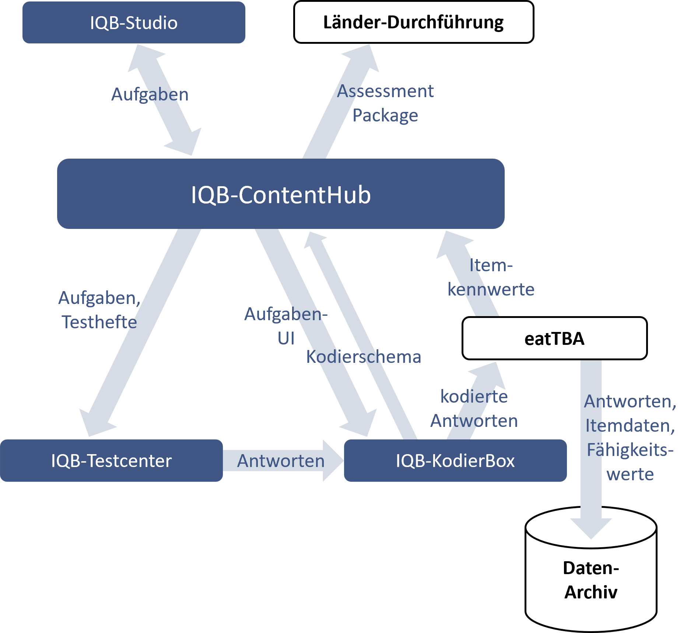
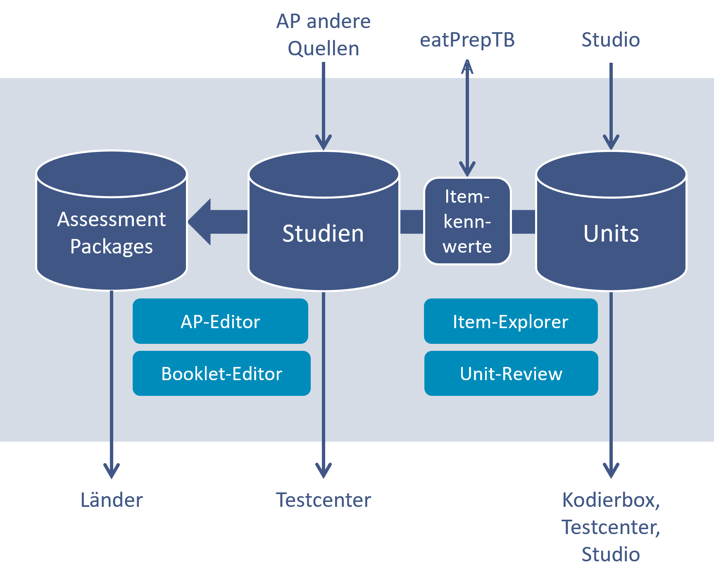

Der IQB-ContentHub ist eine Webanwendung. Es handelt sich also um Software, die auf einem Server installiert werden muss. Das folgende Bild stellt die Funktionen des IQB-ContentHub im Zusammenklang mit den anderen Webanwendungen des IQB-Stack dar. Es handelt sich um eine Zielvorstellung (s. unten [Zeitplan](#zeitplan)):

{width="600" group="content-hub"}

* Der ContentHub dient der dauerhaften Ablage von Aufgaben, die mit dem Studio erstellt wurden. Hier erfolgt auch eine Versionierung, d. h. man kann später auf vorherige Entwürfe zurückgreifen. Möglich wird dies, weil jede Unit im TBA-System eine eindeutige ID bekommt. Wir nennen die Speicherfunktion **Aufgabendatenbank**. Es können keine Aufgabendaten geändert werden, aber alle Daten können eingesehen werden.
* Aus den Daten zu Aufgaben und Studien kann man ein **Assessment Package** erstellen und zum Download bereitstellen. Dieses Datenpaket ist darauf ausgerichtet, in Portallösungen zur Durchführung und Auswertung von Lernstandserhebungen geladen zu werden und diese zu steuern. Neben den Testinhalten sind auch Vorschriften enthalten, wie die Datenauswertung z. B. über Fähigkeitsskalen erfolgen kann.
* Aufgaben und Testhefte können direkt in das IQB-Testcenter geladen werden und so in Tests eingesetzt werden. Bei diesem **Testcenter-Export** sind nicht alle Aufgabendaten erforderlich - beispielsweise werden Metadaten und Rich Notes nicht übertragen. Auch ein Kodierschema wird nur dann übertragen, wenn ein Test dynamische Verzweigung enthält (adaptives Testen).
* Bei einem **Kodierbox-Export** werden ebenfalls nur die nötigen Daten übertragen: Aufgaben-UI und Kodierschema. Als Besonderheit kann die Kodierbox direkt das Editieren eines Kodierschemas anbieten. Das ist dann wichtig, wenn während der Kodierung Unstimmigkeiten festgestellt werden und sofort im Prozess eine Verbesserung umgesetzt werden soll. Im Bild oben ist daher auch die Übertragung geänderter Kodierschemata in den ContentHub vorgesehen.
* Nach der Datenanalyse (im Bild über R-Programmierungen "eatTBA" dargestellt) müssen wichtige Eigenschaftsdaten für die Items in den ContentHub übertragen werden. Dieser **Itemkennwerte-Import** stellt sicher, dass Personenfähigkeiten richtig ermittelt werden können.

{width="600" group="content-hub"}

Das obige Bild zeigt einen genaueren Blick in den ContentHub. Folgende Funktionen sind besonders hervorgehoben:

* Ein **AP-Editor** ermöglicht die Zusammenstellung der Daten für ein Assessment Package. Es sind Metadaten hinzuzufügen (z. B. Zielpopulation), Testphasen zu definieren (z. B. zwei Messzeitpunkte) und die Skalen für die Auswertung zu definieren. Diese Skalen enthalten Aufzählungen von Items mit den jeweils für dieses AP relevanten Itemkennwerten.
* Das Booklet ist die Abfolge von Aufgaben in einer Form, die das Testcenter interpretieren kann. Eine Testung besteht oft aus einer Vielzahl von Booklets, deren Zusammenstellung vielen Kriterien gerecht werden muss (Zeitbeschränkung, bestimmte Schwierigkeitskurve, bestimmte Kompetenzen usw.). Ein **Booklet-Editor** hilft an vielen Stellen des ContentHub bei dieser Zusammenstellung.
* Bei der Vorbereitung einer Studie und auch beim Standard-Setting[^1] müssen große Mengen von Items übersichtlich dargestellt, sortiert und gefiltert werden. Der **Item-Explorer** bietet außerdem eine Kommentarfunktion, den Sprung zur Aufgabe (Ansicht mit beispielhaften Antworten) und das Markieren (Taggen) an.
* Die Aufgaben unterliegen einem aufwändigen Review-Prozess. An vielen Stellen des Entwicklungszyklus' beurteilen Expert\*innen verschiedene Aspekte einer Aufgabe. Im IQB-Stack sind drei verschiedene Szenarien des Reviews umgesetzt. Eines davon ist die detaillierte Sicht auf alle Daten einer Aufgabe (einschl. Metadaten, Kodierung, Rich-Notes usw.) im **Unit-Review** des ContentHub[^2]. Es können Kommentare vergeben werden.

:::{.callout-note}

## Itemkennwerte

Dazu gehören numerische Werte wie empirische Itemschwierigkeit, BISTA-Wert, Infit, Trennschärfe, Lösungsquote. Sie sind einem Item zugeordnet, stammen aber aus einer konkreten Studie. Das bedeutet, dass es mehrere "Sets" von Itemkennwerten geben kann - auch innerhalb einer Studie je nach Testzeitpunkt, Position im Testheft (zu Beginn, zum Ende), Personenmerkmalen (Klassenstufe, Gymnasium ja/nein, ESA-Perspektive ja/nein usw.), Kompetenzbezug (mathematik global oder nur Leitidee 1) und Auswertungsmethode (Partial/Full Credit). Daher können Itemkennwerte nicht unabhängig von einer Studie gespeichert werden.

:::

# Zeitplan

* Aufgabendatenbank (nur Import), Itemkennwerte-Import, Item-Explorer, Unit-Review
  - Prototyp Q3/2026, Release Q4/2026
* Aufgabendatenbank, AP-Editor, Booklet-Editor
  - Prototyp Q4/2026, Release Q1/2027
* Kodierbox-Export, Testcenter-Export, Assessment Package
  - Prototyp Q2/2027, Release Q3/2027

[^1]: Das Standard-Setting ist ein Verfahren zur empririsch gestützten Entwicklung eines Kompetenzstufen-Modells.
[^2]: Die anderen beiden Szenarien werden im IQB-Studio (über Aufgabenfolge ein erster grober Blick auf die Aufgabe; die Kommentare werden direkt zur Unit übertragen) und im Testcenter umgesetzt (Beurteilung der Aufgabe aus Sicht der Testperson im Kontext eines Booklets).