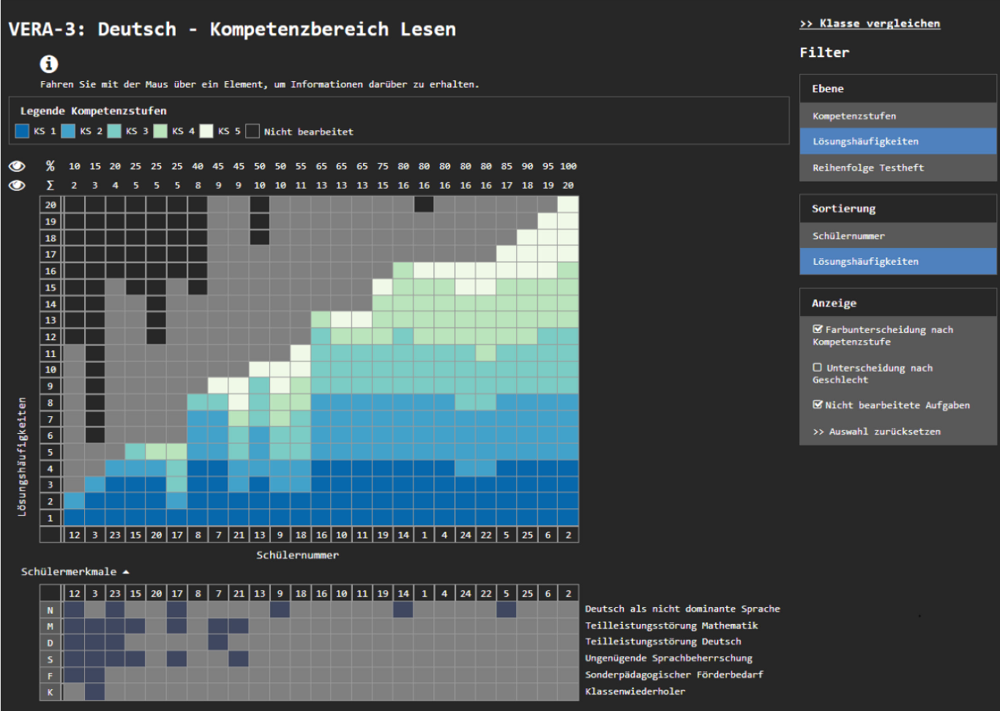
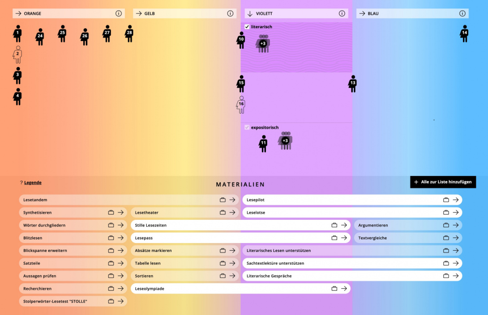
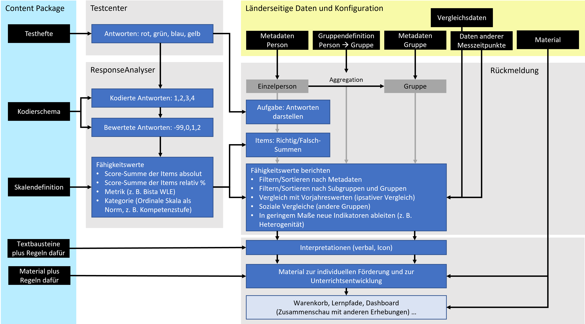

# Ausblick Rückmeldungen

Die Kompetenzdaten werden bei Lernstandserhebungen in den Rückmeldungen an die Lehrkräfte verwendet. Der ResponseAnalyser bzw. andere Analysemethoden liefern diese Werte pro Person, und das Rückmeldesystem verbindet dann verschiedene Personen mit ihren Merkmalen. Es finden diverse Aggregationen statt, die sich auf die Gruppen von Personen (Klasse, Schule, Land) beziehen.

Die Rückmeldungen sind **nicht Gegenstand der Spezifikationen** an dieser Stelle. Insbesondere die Aggregationen der Personenwerte bleiben hier offen. Die folgenden Ausführungen sollen dazu anregen zu prüfen, ob die personenbezogenen Daten aus dem ResponseAnalyser eine hinreichende Grundlage für Rückmeldungen sein können.

# Kodierte Antworten

In einer Rückmeldung kann für jede Antwort gezeigt werden, was die Testperson geantwortet hat. Dies kann in einem Verona-kompatiblen System beispielsweise über Replay implementiert werden, d. h. die Aufgabe wird angezeigt und die Antwortdaten der Testperson werden dazu geladen. Außerdem kann mitgeteilt werden, wie die Antworten bewertet wurden (richtig, falsch).

# Item- und Skalenwerte

Der ResponseAnalyser gibt die Matrix der Itemwerte aus. Darin sind alle Items mit ihren Werten enthalten, die die Testperson beantwortet hat. Hier finden sich `0` und `1` für “richtig” und “falsch”, aber auch `-9` für “nicht beantwortet” oder “nicht auswertbar”. Im Assessment Package sind außerdem Skalen definiert, die auch genau angeben, welche Items zu welcher Skala gehören.

Aus diesen Informationen lassen sich Übersichten erzeugen, die Werte auf Item- und Skalenebene kombinieren. Beispiel (Quelle: [Pukrop, 2019, S. 233](#ref-Pukrop.2019)):

Beispiel Kombination Item-Werte und Kompetenzstufen

# Bausteine für Interpretationen

Die Transformation eines numerischen Fähigkeitswertes in eine Stufenskala ist bereits eine Interpretation. Darüber hinaus könnten im Assessment Package weitere Testbausteine definiert sein, die – mit Regeln versehen – eine Rückmeldung anreichern.

# Verlinkung zu Unterrichtsmaterial

Da die Skalen im Assessment Package Verlinkungen auf öffentliche Vokabulare enthalten können (z. B. zu KMK-Kompetenzstufen), sind Empfehlungen für die Weiterarbeit im Unterricht automatisch möglich. Vorausetzung dafür ist eine Datenbank mit Material, das dieselben öffentlichen Vokabulare für Metadaten nutzt. Das folgende Beispiel enthält im unteren Bereich Materialempfehlungen (Quelle: [Krelle, 2020, S. 3](#ref-LeseCheck.2020)).

Beispiel Zuordnung von Unterrichtsmaterial

# Abgrenzung Rückmeldungen

Es ist nicht einfach, die komplexen Funktionen einer Rückmeldung einheitlich zu beschreiben. Ein Rückmeldeportal wird stets vielfältige Darstellungen und Unterstützungsangebote enthalten, um den Nutzen aus der Datenerhebung zu maximieren. Die folgende Darstellung versucht nocheimal, den Beitrag von IQB-Inhaltspaket und IQB-ResponseAnalyser zu klären (zum Vergrößern auf das Bild klicken):

Strukturschema Rückmeldung

Zurück nach oben

## Literatur

Krelle, M. (2020). *Zur Konzeption des Leseverstehens im Lesecheck: Was wird wie gemessen?* ISQ Berlin, Universität Jena. <https://www.isq.berlin/wordpress/wp-content/uploads/2020/08/Leseverstehen-und-Lesecheck-Konzept.pdf>

Pukrop, J. (2019). *Rückmeldungen aus Schulleistungstests an Lehrkräfte durch interaktive Informationsvisualisierungen*. Universität Bremen. <https://nbn-resolving.de/urn:nbn:de:gbv:46-00107782-12>
