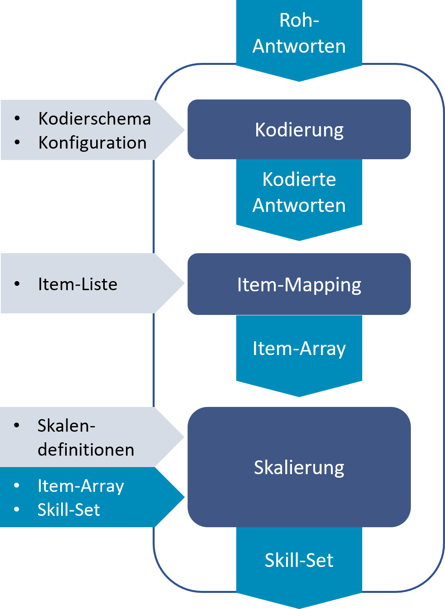

# ResponseAnalyser

Der IQB-ResponseAnalyser ist ein Webservice. Es handelt sich also um Software, die auf einem Server installiert werden muss, aber über keine Oberfläche/Frontend verfügt. Andere Programmierungen sollen auf eine automatisierte Art den Service benutzen. In einem produktiven Szenario ist der Webservice nicht von außen erreichbar, sondern nur durch Komponenten in einem lokalen geschützten Netzwerk.

# Funktionen

Übersicht der Funktionen des ResponseAnalysers

- **Kodierung**: Die Antworten einer Testperson werden übergeben. Es erfolgt eine automatische Kodierung (Einbinden des Autocoders). Damit die Antworten kodiert werden können, muss für jede Unit und jede Variable eine Kodiervorschrift verfügbar sein (sog. Kodierschema).
- **Item-Mapping**: Für die Weiterverarbeitung der Antwort-Codes müssen die Variablen umbenannt werden. Hierzu ist eine Item-Liste zu liefern. Außerdem muss das Verfahren für den Fall geklärt werden, dass eine Kodierung nicht möglich war. Dazu dient die Missing-Map, die dann festlegt, ob der Wert ‘0’ oder ein einheitlicher Missing-Wert vergeben wird.
- **Skalierung**: Mithilfe der übergebenen Skalendefinitionen werden aus den Itemwerten Fähigkeitswerte ermittelt. In diese Berechnung können für die Testperson weitere Werte einfließen, die separat ermittelt und gespeichert wurden: Weitere Itemwerte (z. B. aus einer Beobachtung durch die Testleitung) oder Fähigkeitswerte aus vorherigen Berechnungen (z. B. aus einer Testung im Vorjahr; dann kann ein Lernfortschritt ermittelt werden).

# Nutzungsszenarien

## Einbindung in Portalsystem

Der häufigste Anwendungsfall ist die Nutzung durch ein übergreifendes Portalsystem für eine Lernstandserhebung. Dieses Portalsystem bereitet die Testung vor und soll nach der Testung die Antworten so aufbereiten, dass für die Lehrkraft eine Ergebnisrückmeldung erfolgen kann. Der Schritt der Transformation der Roh-Antworten in Fähigkeitswerte pro Person soll automatisch erfolgen: Unmittelbar nach der Testung einer Klasse sind die Ergebnisse darstellbar, ohne dass jemand die Daten manuell umformt.

Der Dienst “ResponseAnalyser” ist in die Portallösung integriert. Es gibt keine Stand-Alone-Installation des ResponseAnalysers, die mit “irgendeiner” Portallösung kommuniziert.

Ein Portalsystem könnte mehrere verschiedene Testungen gleichzeitig administrieren. Daher ist pro Testung ein isolierter Bereich (“Workspace”) erforderlich. Nur so kann man Verwechslungen von Units unterbinden oder unterschiedliche Missing-Maps gewährleisten. Bei großen Testungen muss eine hohe Last bewältigt werden. Der ResponseAnalyser sollte daher gut skalieren. Die permanenten Daten eines Arbeitsbereiches erfordern für die Replizierbarkeit eine clusterfähige Speicherlösung.

> **CAUTION:**
>
> - Da nur der integrierte Betrieb innerhalb einer Portallösung und keine Stand-Alone-Installation vorgesehen ist, wird der ResponseAnalyser innerhalb eines lokalen Netzwerkes betrieben. Es ist keine Authentifizierung nötig, da der Zugriff durch die Portallösung immer erlaubt und ein externer Zugriff nicht möglich ist. Es gibt kein Rechte-Rollen-Konzept.
> - Personenbezogene Daten werden nicht gespeichert. Sie sind nur während der Bearbeitung genau eines Requests bekannt.

## Nur Kodierung/Direkt

Für die Verarbeitung von Antworten nutzt das IQB die Webanwendung IQB-Kodierbox. Wenn man diese komplexe Software nicht installieren möchte, kann man für die automatische Kodierung auch den ResponseAnalyser nutzen. Wenn keine Skalendefinitionen hinterlegt sind, wird nur kodiert. Über Skripte (PowerShell, R usw.) kann man die API entsprechend bedienen. Auch das Erstellen der Item-Liste könnte über den ResponseAnalyser einfacher erfolgen als manuell.

> **NOTE:**
>
> Die folgenden Darstellungen beziehen sich nur auf das Nutzungsszenario “Portalsystem”.

# Operationen und Datenfluss

## Vorbereitung

Das Portalsystem sollte eine Funktion “Neue Studie anlegen” oder ähnliches bieten. Teil dieser Funktion sollte das automatische Anlegen eines korrespondierenden Arbeitsbereiches und die Übertragung übergreifender permanenter Daten sein. Man könnte auch den Start der ersten Testung als Gelegenheit implementieren, den Arbeitsbereich anzulegen.

Nach dem Anlegen sollten einmalig alle übergreifenden permanenten Daten in den Arbeitsbereich übertragen werden:

- Kodierschemata aller Units
- Liste aller Items
- Missing-Map
- alle Skalendefinitionen

Wenn sich zwischenzeitlich einige dieser Daten ändern (z. B. ein Kodierschema wurde als fehlerhaft erkannt und soll ausgetauscht werden), dann sollten alle Workspace-Daten gelöscht und komplett neu eingespielt werden. Die Portallösung sollte gewährleisten, dass Änderungen die Vergleichbarkeit der Ergebnisse nicht gefährdet und ggf. alle Antworten erneut analysieren lassen.

## Durchführung

Während der Testung werden fortlaufend die Antworten an den ResponseAnalyser mit Bezug zum korrespondierenden Workspace gegeben:

- Für jede Person werden alle verfügbaren Antworten übergeben
- Aus der Datenbank werden - sofern vorhanden - für diese Person zusätzliche Daten aus anderen Quellen übergeben (Item-Werte, Skalen-Werte)

Der ResponseAnalyser kennt alle theoretisch möglichen Skalenwerte, meldet aber nur die zurück, zu denen er Daten erhalten hat.

Der Output des ResponseAnalysers soll in einer Datenbank gespeichert werden. Aus dieser Quelle werden anschließend die Aggregationsdaten (Klasse, Schule usw.) erstellt, die Rückmelde-Diagramme gespeist und ggf. Daten an externe Dashboards übermittelt.

Der ResponseAnalyser speichert keine personenbezogenen Daten und kennt die ID oder auch Metadaten der Testperson nicht. Sollte eine Testperson an verschiedenen Testungen teilnehmen, kann auch ersteinmal ein unvollständiger Antwort-Satz an den ResponseAnalyser gegeben werden. Dann können Ergebnisrückmeldungen nur teilweise erfolgen. Dieses Vorgehen ist z. B. sinnvoll, wenn Fähigkeitswerte sich jeweils nur aus den Antworten einer Teil-Testung speisen (z. B. Mathematik und Deutsch in getrennten Instrumenten). Sowie jedoch Fähigkeitswerte auf Items aus mehreren Teil-Testungen basieren, müssen alle Antworten aus allen Teil-Testungen an den ResponseAnalyser übergeben werden. Dann werden ggf. schon in der Ergebnisdatenbank vorhandene Werte überschrieben.

## Abschluss

Es sollte in der Portallösung eine Funktion geben, mit der man die Durchführung einer Studie für beendet erklärt. Alle Testungen sind dann durchgeführt und wurden über den ResponseAnalyser ausgewertet. Alle möglichen Ergebnisdaten sind (permanent) gespeichert. Zu diesem Zeitpunkt müsste der korrespondierende Arbeitsbereich im ResponseAnalyser gelöscht werden.

# Datenstrukturen

## Antworten

Eine Antwort ist eine Datenstruktur, die während der Testdurchführung vom Player erzeugt wird. Sie muss einer Unit und einer Testperson zugeordnet werden.

Unter Unit ist hier (a) das konkrete Vorkommen der Unit in einem Booklet (=**Unit-Alias**) und (b) eine Referenz zu einer Unit-Definition (=**Unit-ID**) gemeint. Normalerweise sind beide Angaben identisch. Aber sollte eine Unit (“Wie motiviert bist Du, den Test durchzuführen?”) mehrfach in einem Booklet auftauchen, gibt es einerseits die Unit-ID zum Auffinden der UI-Definition und des Kodierschemas usw., und außerdem gibt es den Unit-Alias für die Zuordnung der Antwort zur konkreten Nutzung der Unit. Das Testcenter generiert den Alias automatisch, sollte er nicht explizit vorgegeben sein, und speichert die Antworten ausschließlich mit dem Alias, nicht der Unit-ID.

> **WARNING:**
>
> Der ResponseAnalyser bekommt keine Information darüber, aus welchem Booklet die Antworten kommen. Sollten Antworten einer Person für dieselbe Unit mit demselben Alias in verschiedenen Booklets auftauchen, kann nur eine Antwort pro Unit-Variable verarbeitet werden. Es werden ggf. die Antworten unsystematisch überschrieben. Das Testdesign muss also dann über verschiedene Aliase eine korrekte Verarbeitung sicherstellen.

Während des Kodierprozesses bleibt die Datenstruktur der Antwort erhalten. Es werden ggf. der Status geändert und neue Informationen hinzugefügt (Code, Score).

## Unit

- Für das automatische Kodieren ist das **Kodierschema** der Unit erforderlich. Es wird unverändert an den Autocoder weitergegeben, ohne dass der ResponseAnalyser eine Validierung o. ä. vornehmen müsste. Probleme meldet ggf. der Autocoder.
- Die Antworten werden zunächst für jede Unit getrennt auf der Basis von Variablen verarbeitet. Diese Datenstruktur muss vor der Skalierung in eine einfachere Struktur (id, code, score) überführt werden - der sog. Itemwert-Liste. Für diese Transformation sind die Informationen **Item-Liste** aus den Unitdaten erforderlich sowie allgemeine Regeln zur Umbenennung und zur Behandlung fehlender Werte (s. u.).

## Skalen

Um die Fähigkeitswerte zu ermitteln, werden Itemwerte verarbeitet. Die Regeln hierzu sind in der Datenstruktur **Skalendefinition** gespeichert.

# Konfiguration

Neben dem Hochladen der Unitdaten und der Skalen soll der ResponseAnalyser eine Konfiguration erhalten, mit der das Standardverhalten punktuell überschrieben werden kann.

- **Missings**: Aus der Datenstruktur der Antwort wird ein Status mitgeliefert. Der gewünschte Status nach der Kodierung ist `CODING_COMPLETE`. Alle anderen Werte führen dazu, dass entweder das Item den Wert `0` oder einen negativen Wert für das statistische `sysmis` erhält. In der Missing-Map kann man steuern, wann welcher der beiden Werte gesetzt wird.
- **Itemname**: Sollte für eine Unit keine Itemliste geliefert werden, kann man Items aus den Variablen der Unit automatisch erzeugen. Standardverhalten wäre, dass alle Variablen Items sind und als Präfix den Alias der Unit bekommen. Varianten:
  1.  ein bestimmtes Zeichen soll als Trenner eingefügt werden,
  2.  wenn der Variablenname eine bestimmte Länge überschreitet (z. B. 4), dann soll kein Präfix gesetzt werden,
  3.  wenn es nur eine Variable pro Unit mit `CODING_COMPLETE` gibt, dann soll das Item den Unit-Alias als Namen bekommen (Weglassen des Variablennamens)

Zurück nach oben
